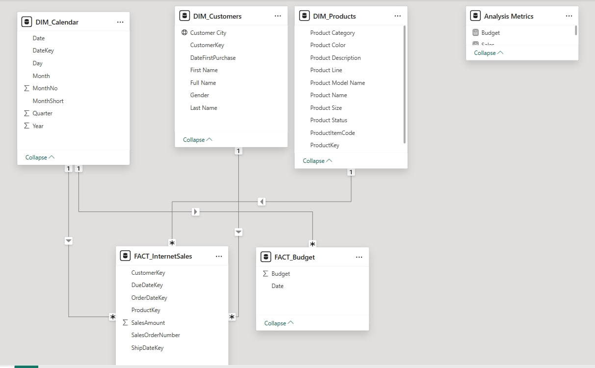

# PowerBI Project
<h1 align="center">Hi, My name is Nikolai!

</h1>
<h2 align="center">I am a Data Analyst.</h2>

<h2>This is my Data Analyst Portfolio Project – Sales Management:</h2>
<ol>
   <li>
      <h3>Requirements gathering</h3>
      
<strong>Description:</strong> Business Request & User Stories.

The business request for this data analyst project was an executive sales report for sales managers. Based on the request that was made from the business we following user stories were defined to fulfill delivery and ensure that acceptance criteria’s were maintained throughout the project.

| # | As a               | I want                                        | So that I                                           | Acceptance Criteria                                                                       |
|---|--------------------|-----------------------------------------------|-----------------------------------------------------|--------------------------------------------------------------------------------------------|
| 1 | Sales Manager      | To get a dashboard overview of internet sales | Can follow better which customers and products sell the best | A Power BI dashboard which updates data once a day                                         |
| 2 | Sales Representative | A detailed overview of Internet Sales per Customers | Can follow up my customers that buy the most and who we can sell more to | A Power BI dashboard which allows me to filter data for each customer                    |
| 3 | Sales Representative | A detailed overview of Internet Sales per Products  | Can follow up my products that sell the most        | A Power BI dashboard which allows me to filter data for each product                     |
| 4 | Sales Manager      | A dashboard overview of internet sales        | Follow sales over time against budget               | A Power BI dashboard with graphs and KPIs comparing against budget                        |

  
    <li>
      <h3>Data Cleansing & Transformation (SQL)</h3>
      
<strong>Description:</strong> To create the necessary data model for doing analysis and fulfilling the business needs defined in the user stories, the following tables were extracted using SQL.

One data source (sales budgets) was provided in Excel format and was connected in the data model in a later step of the process.

<strong>SQL Files:</strong>
<ul>

   <li><a href="https://github.com/NikolaiB-ux/End_to_end_Project_2025/blob/main/Dim_Calender.sql">Dim_Calender</a></li>
   <li><a href="https://github.com/NikolaiB-ux/End_to_end_Project_2025/blob/main/DIM_Customers.sql">Dim_Customers</a></li>
   <li><a href="https://github.com/NikolaiB-ux/End_to_end_Project_2025/blob/main/Dim_Products.sql">Dim_Products</a></li>
   <li><a href="https://github.com/NikolaiB-ux/End_to_end_Project_2025/blob/main/FactInternetSales.sql">FactInternetSales</a></li>
</ul>

Below are the SQL statements for cleansing and transforming necessary data.
 
  
   
    
   
   

   <li>
      <h3>Data Modeling</h3>
      

      <strong>Description:</strong> 
Below is a screenshot of the data model after cleansed and prepared tables were read into Power BI.

This data model also shows how FACT_Budget has been connected to FACT_InternetSales and other necessary DIM tables.
 
  
      
      

   </li>
   <li>
      <h3>Sales Management Dashboard</h3>
      

         <strong>Description:</strong> The finished sales management dashboard includes a main overview page, plus two additional pages with detailed tables and visualizations showing sales over time, by customer, and by product.
      

      
      
   </li>
   
   </li>
   </li>
</ol>
<h2>Languages and Tools:</h2>

  
  
  
  
  
  

<h2>Contacts</h2>
<ul>
   <li>
      Telegram: <a href="https://t.me/Nikolay23B">Nikolai Bogdanov</a>
   </li>
   <li>
      E-mail: <a href="mailto:nikolaybogdanov953@gmail.com">Nikolai Bogdanov</a>
   </li>
</ul>